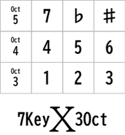

# 7Keyx3Oct
<!-- pandoc -f markdown -t html5 -o README.html -c github.css README.md -->

4x3のキーを持つマイクロパッド [zero-kb02](https://github.com/sago35/tinygo_keeb_workshop_2024/blob/main/buildguide.md) を電子楽器にするプログラムです。   
ドからシまでの7キーと音域切替キーで3オクターブの音域をカバーしています。＃や♭の半音もサポートしています。  

## Hardware

TinyGo Keeb Tour 2025で、頒布されたマイクロパッド[zero-kb02](https://github.com/sago35/tinygo_keeb_workshop_2024/blob/main/buildguide.md) を使用しました。  

  

このマイクロパッドは、Raspberry Pi Pico と同じRP2040チップを搭載したマイコンボード[RP2040-Zero](https://www.waveshare.com/wiki/RP2040-Zero)で作られています。  
標準では、音を出す機能はないので、拡張コネクタのGPIO14とGNDに[圧電サウンダー,13mm](https://akizukidenshi.com/catalog/g/g104118/)
を接続しています。  

## Software

[TinyGo](https://tinygo.org/) で開発しました。  

キーマトリクスを読み取り、押されたキーの組み合わせをチェックして、対応する音階を圧電サウンダーから出力しています。  

### ファームウェアのインストール  

ソース・ファイルを公開していますが、コンパイルが面倒な方は、以下の手順でコンパイル済みのファームウェアをインストールして下さい。

1. 以下のKeyx3Octのファームウェア(UF2ファイル)をダウンロードして下さい。

> [uf2/7Keyx3Oct.uf2](uf2/7Keyx3Oct.uf2)

2. zero-kb02上のマイコンボード RP2040-ZeroにあるBOOTSELボタンを押しながら、RESETボタンを押して下さい。  
zero-kb02がRPI-RP2ドライブとしてマウントされます。  

3. ダウンロードしたKeyx3OctファームウェアのUF2ファイルをPicoのRPI-RP2ドライブにコピーして下さい。
RP2040-Zeroが、自動的に再起動して、インストールと初期化が完了します。

### 開発環境のインストール  

ソースコードから、インストールしたい方は、開発環境を導入して下さい。  
ここでは、Windows11上での開発環境構築について解説します。他のOSについては、本家サイトの解説をお読み下さい。  

1. パッケージ管理ツールscoopのサイトを開き、導入スクリプトを入手して下さい。  

	[scoop](https://github.com/ScoopInstaller/Scoop)

2. Powershellを開いて、以下のスクリプトを実行して下さい。  

> \> Set-ExecutionPolicy -ExecutionPolicy RemoteSigned -Scope CurrentUser  
> \> Invoke-RestMethod -Uri https://get.scoop.sh | Invoke-Expression  

3. 以下のコマンドを実行して、環境構築は終了です。

> \>scoop install go tinygo

4. 以下のコマンドを実行できれば、正常にインストール
できています。  

> \>tinygo version  
tinygo version 0.38.0 windows/amd64 
(using go version go1.24.4 and LLVM version 19.1.2)

### コンパイル方法  

ソースコードは、[main.go](main.go) です。  
このソースコードのあるディレクトリに移動して、以下のコマンドを実行して下さい。コンパイルが完了すると、生成した実行用バイナリはzero-kb02に転送されます。  

    > tinygo flash --target waveshare-rp2040-zero --size short -monitor .

また、実行用バイナリを転送できない場合は、以下のコマンドで、実行用バイナリを作成し、手作業で、実行用バイナリをzero-kb02に転送して下さい。  

    > tinygo build -o 7Keyx3Oct.uf2 --target waveshare-rp2040-zero --size short .

## キーレイアウトと仕様

このマイクロパッドは、キーの数が、4x3=12個と限られているので、単純に音階をキーに割り当てていくと、全12音で、音域は1オクターブになってしまいます。  
そこで、[かんぷれ](https://kantan-play.com/co/) という楽器を参考にし、以下のようなキーレイアウトにしました。  
7個のキーを音階キーに割当てて、残ったキーを半音とオクターブの切替えに割当て、3オクターブの音域を発音を発音できるようにしました。  

|      |col0 |col1 |col2 |col3 |
| ---- | --- | --- | --- | --- |
| row0 |Oct5 |  7  | ♭  |  #  |
| row1 |     |  4  |  5  |  6  |
| row2 |Oct3 |  1  |  2  |  3  |

キートップの印刷用データを用意しました。  
全面のラベルシール等に印刷してご利用下さい。  

* [A4サイズ](pdf/KeyTopSeal_A4.pdf)  
* [はがきサイズ](pdf/KeyTopSeal_Postcard.pdf)  

### 音階キー

7Keyx3Oct では、[かんぷれ](https://kantan-play.com/co/) で使われている数字譜を採用しました。  
以下のように、単純に数字が順番にキーに割り振られているだけです。  
基本状態は、4オクターブの7音になっています。
以下が、その対応表です。  

| 数字譜           | 1      | 2      | 3      | 4       | 5      | 6      | 7      |
|:-----------------|:------:|:------:|:------:|:-------:|:------:|:------:|:------:|
| イタリア語音階名 |ド (Do) |レ (Re) |ミ (Mi) |ファ (Fa)|ソ (Sol)|ラ (La) |シ (Si) |
| 日本語音階名     | ハ     | ニ     | ホ     | ヘ      | ト     | イ     | ロ     |
| 英語音階名       | C      | D      | E      | F       | G      | A      | B      |
| ドイツ語音階名   | C      | D      | E      | F       | G      | A      | H      |

#### 機能キー

* 半音キー
    * '#'キー   このキーを押しながら音階キーを押すと、半音上がった音が鳴ります。  

    * '♭'キー   このキーを押しながら音階キーを押すと、半音下げた音が鳴ります。  

* オクターブキー
    * 3 Oct キー
        このキーを押しながら音階キーを押すと、3 オクターブの音が鳴ります。    
    * 5 Oct キー
        このキーを押しながら音階キーを押すと、5 オクターブの音が鳴ります。    

オクターブキーを押していない時は、すべて 4 オクターブに設定されます。  

## 数字譜集

簡単な数字譜の楽譜を用意しました。  
これらで、練習して下さい。  

### 指慣らし

#### [時報](MusicCollection/Jihou.md)
正時を知らせる時報の音です。  
NHKの時報は、正時の3秒前から440Hzの予報音(中央ラ音)を3回、正時に880Hzの正報音(1オクターブ高いラ音)を1回鳴らす。  

> [数字譜へ](MusicCollection/Jihou.md)

#### [Thirori Sound](MusicCollection/ThiroriSound.md)
某大手ハンバーガーチェーンで、ポテトが揚がったときに店内で流れるタイマーの音です。  
ひたすら、リピートして下さい。  

> [数字譜へ](MusicCollection/ThiroriSound.md)

#### [未知との遭遇](MusicCollection/Michi.md)  
未知の飛行物体との交信音です。  
ひたすら、リピートして下さい。 

> [数字譜へ](MusicCollection/Michi.md)

### 初級  

#### [かえるの合唱](MusicCollection/Froschgesang.md)  

19世紀のドイツの童謡「Froschgesang」を原曲とする、日本の唱歌・童謡です。通称、「かえるの歌」  

> [数字譜へ](MusicCollection/Froschgesang.md)  

#### [ウェストミンスターの鐘](MusicCollection/WestminsterQuarters.md)  
(英語：Westminster Quarters)

ウェストミンスター宮殿の時計塔ビッグ・ベンで使われている時鐘のメロディ。  
日本では学校のチャイムとして使われています。  

> [数字譜へ](MusicCollection/WestminsterQuarters.md)

#### [桃太郎](MusicCollection/MomoTarou.md)  

桃太郎のおとぎ話について歌った、日本の童謡です。  
作詞者は不詳、作曲者は岡野貞一  

> [数字譜へ](MusicCollection/MomoTarou.md)  

### 中級  

#### [ラーメン屋さん](MusicCollection/Ramen.md)
屋台のラーメン屋さんが客寄せにチャルメラで吹いていた曲

> [数字譜へ](MusicCollection/Ramen.md)	

#### [チェッチェッコリ](MusicCollection/CheChe_Koolay.md)  

アフリカのガーナ民謡とされている子供の遊び歌  

> [数字譜へ](MusicCollection/CheChe_Koolay.md)  

#### [歓喜の歌　Ode to Joy](MusicCollection/Ode_to_Joy.md)  

ベートーヴェンの交響曲第9番の第4楽章で歌われ、演奏される第一主題  

> [数字譜へ](MusicCollection/Ode_to_Joy.md)  

#### [赤とんぼ](MusicCollection/Akatonbo.md)  

三木露風の作詞、山田耕筰の作曲による、日本の代表的な童謡  

> [数字譜へ](MusicCollection/Akatonbo.md)  

### 上級  

#### [Ievan Polkka イエヴァン・ポルッカ](MusicCollection/IevanPolkka.md)  

ネット上で高い知名度を持つフィンランド民謡。  
日本語では，イエヴァのポルカ。ボーカロイド 初音ミクでよく使われる曲  

> [数字譜へ](MusicCollection/IevanPolkka.md)  

#### [猫踏んじゃった](MusicCollection/NekoFunjyatta.md)  

作曲者不詳、変ト長調または嬰ヘ長調の世界中で親しまれている曲。  

> [数字譜へ](MusicCollection/NekoFunjyatta.md)  

#### [聖者の行進　When the Saints Go Marching In](MusicCollection/WhenTheSaintsGoMarchingIn.md)  

黒人霊歌の一つで、ディキシーランド・ジャズのナンバーとしても知られている。  

> [数字譜へ](MusicCollection/WhenTheSaintsGoMarchingIn.md)  

#### [Puff The Magic Dragon](MusicCollection/PUFF.md)  

アメリカ合衆国のフォークソング・グループのピーター・ポール&マリーの楽曲。  

> [数字譜へ](MusicCollection/PUFF.md)  

